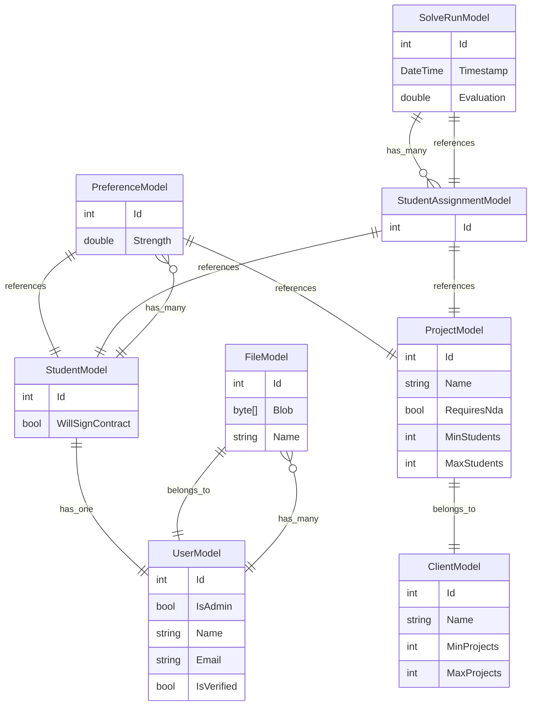

# GroupAllocator

## Fullstack Setup (Testing)

1. Install Docker Desktop ([https://www.docker.com/products/docker-desktop/](https://www.docker.com/products/docker-desktop/))
2. Run `docker compose up --build --force-recreate` (Ctrl+C to stop)

## Frontend Setup (Development)

1. Install Node.js ([https://volta.sh/](https://volta.sh/))
2. Install PNPM (`npm i -g pnpm`)
3. Install dependencies (`pnpm i`)
4. Run `pnpm dev`

## Backend Setup (Development)

### Database

1. Install docker & docker-compose
1. Run `docker-compose -f database.yml up -d`

### Application - Windows

1. Install Visual Studio with ASP.NET workload and .NET 9.0 component
2. In the Group-allocator/backend/group-allocator directory, run the following commands:
   1. `dotnet tool restore` 
   2. `dotnet run`

### Application - Mac/Linux

1. Install [.NET 9 SDK](https://dotnet.microsoft.com/en-us/download/dotnet/9.0)
1. In `backend/GroupAllocator.Backend` run `dotnet run`

